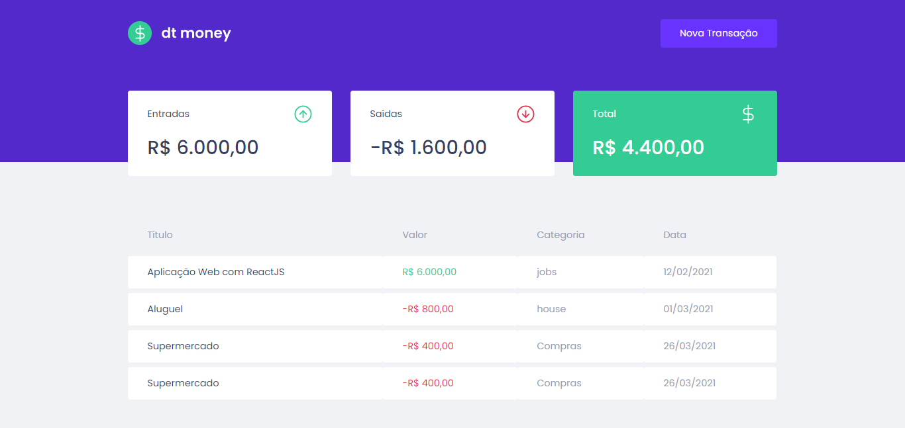
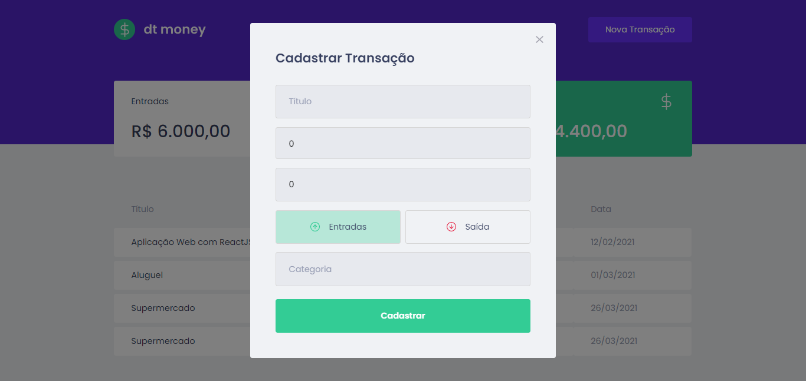

# Money-Control
Application for the control of finances

<h3 align="center">
    
    <br><br>
    <b>Manage your spending!</b> 
</h3>

# Sumary

- [About](#about)
- [Technologies](#tecnologies)
- [How to Setup](#how-to-setup)
- [Contributions](#contribuitions)

<a id="about"></a>

## :bookmark: About

<strong> Money-Control </strong> is a web application to help people control their spending

## Screenshots

<div align="center" id="top"> 
  
</div>
<br/>
<br/>
<div align="center" id="top"> 
  
</div>

## Features

- Table with personal finance data with name, amount, category and date.
- Summary cards with incomes, outcomes and total.
- Button that Create a new transaction using a beautiful modal.

<a id="tecnologies"></a>

## :rocket: Tecnologies

The project was developed using the following technologies

- [React](https://pt-br.reactjs.org/)
- [TypeScript](https://www.typescriptlang.org/)
- [MirageJS](https://miragejs.com/)
- [Polished](https://polished.js.org/)
- [Axios](https://github.com/axios/axios)
- [Styled Componensts](https://styled-components.com/)


<a id="how-to-setup"></a>

## :fire: How to setup

- ### **Prerequisites **

  - It is **necessary** to have **[Node.js](https://nodejs.org/en/)** installed on the machine
  - Also, it is **necessary** to have a package manager either **[NPM](https://www.npmjs.com/)** or **[Yarn](https://yarnpkg.com/)**.

first clone or download the repository:

```sh
  $ git clone https://github.com/Valves133/Money-Control.git
```

After that you can install the dependencies by executing the following command in the root folder of the project
 l 
```sh
# Install dependencies

$npm install
or with yarn
$ yarn


# Start the apllication in development mode

 # App moneycontrol
 
  $ cd moneycontrol
  
  $ npm start
  or
  $ yarn start
 
  ```


<a id="contribuitions"></a>

## :recycle: Contribuitions

-Fork this repository,
- reate a branch with your feature: `git checkout -b my-feature`
- Commit your changes: `git commit -m 'feat: My new feature'`
- Push your ch: `git push origin my-feature`


## :memo: License

This project is under the MIT license. See the file [LICENSE](LICENSE.md) for more details.

---

<h4 align="center">
    Made with 💜 by <a href="https://www.linkedin.com/in/victor-hugo-mendes-alves-075105157/" target="_blank">Victor Alves</a>
</h4>
